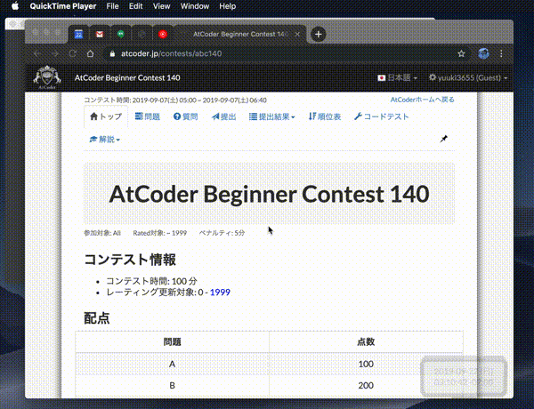

AtCoder Tools IntelliJ Plugin
====
IntelliJ Platformで動作するIDEからAtCoder Toolsを使用するためのPluginです。

`atcoder-tools`で生成したファイルを元にプロジェクトモジュールを作成し、IDEの環境を自動で整えることを目的としています。

現在のバージョンでは、C++ (CLion), Java (IntelliJ CE)のみ対応しています。

## Demo

## Actions
- `aGen` 指定したコンテスト用にプロジェクトモジュールを初期化する
- `aTest` 選択した問題のサンプルテストを実行する
- `aSubmit` 選択した問題のサンプルテストを行い、回答を提出する
- `aStop` 実行中のプログラムを停止する
